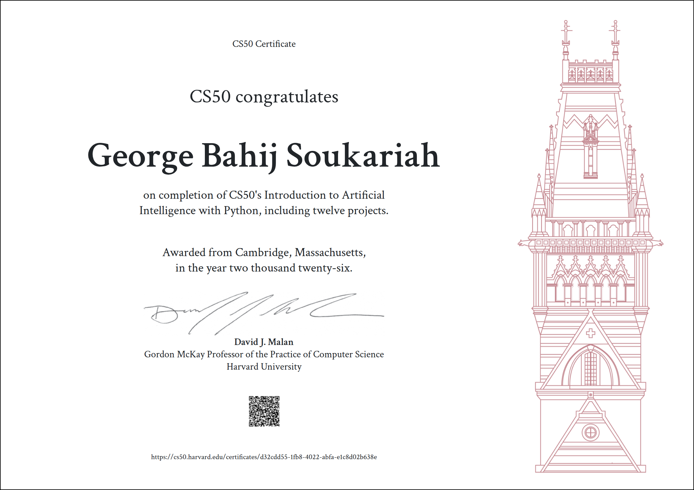

# CS50xAI — CS50's Introduction to Artificial Intelligence with Python

TL;DR: This repository contains my coursework for Harvard's CS50xAI course (CS50's Introduction to Artificial Intelligence with Python). It organizes assignments, projects, and notes by module and project folders.

## Purpose
- Repo of exercises and projects completed for CS50xAI; intended for learning, review, and demonstration of solutions.

## Repo Layout (top-level)
- **[Project 0/](Project%200/)**: Degree analytics and Tic-Tac-Toe project.
- **[Project 1/](Project%201/)**: Knights and Minesweeper projects and assets.
- **[Project 2/](Project%202/)**: Heredity, PageRank, and web corpus materials.
- **[Project 3/](Project%203/)**: Crossword generator and assets.
- **[Project 4/](Project%204/)**: Nim and shopping exercises.
- **[Project 5/](Project%205/)**: Traffic model assets and trained models.
- **[Project 6/](Project%206/)**: Attention, parser utilities, and analysis artifacts.

## Setup (high level)
- Prerequisites: A Python 3.12 installation and a working virtual environment manager are recommended.
- Install dependencies from the repository requirements files Use a separate environment for reproducibility.
- When running or testing a particular project, change into that folder and follow the project-specific README or inline comments.

## Running & Verifying (guidance)
- Each project generally contains a main driver or runner file (look for filenames like runner.py, *.py in top of each folder). Consult those files for usage examples.
- For exercises that load data (CSV, text, or models), ensure relative data folders remain adjacent to the code (do not move data out of its folder unless updating code paths).

## Academic Honesty & Usage Policy

This repository is maintained strictly for documentation, learning review, and personal portfolio demonstration. 
If you are currently enrolled in Harvard's CS50xAI (or any equivalent course), **please do not copy or plagiarize any code from this repository.** Doing so violates the [CS50 Academic Honesty Policy](https://cs50.harvard.edu/ai/honesty/). 
I do not authorize the redistribution, reproduction, or modification of this code for the purpose of submitting it for course credit.

## Badges & Useful Links
- [Official course page](https://cs50.harvard.edu/ai/)
- [Certificate link](https://cs50.harvard.edu/certificates/d32cdd55-1fb8-4022-abfa-e1c8d02b638e)
